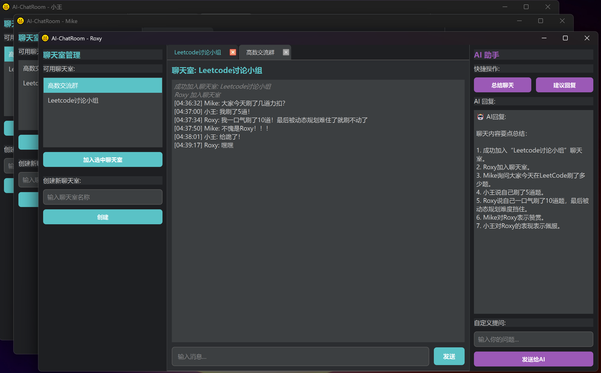

# AI-ChatRoom

[](https://github.com/Chenwhich778/AI-ChatRoom/stargazers)
[](https://github.com/Chenwhich778/AI-ChatRoom/network/members)


一个功能完整的多人聊天室应用，基于 Qt 6 和 TCP 网络通信开发，集成 AI 助手功能。

## ✨ 主要特性

- 🔐 **用户认证系统** - 安全的登录机制
- 💬 **多聊天室支持** - 用户可同时加入多个聊天室，通过标签页切换
- 🤖 **AI 智能助手** - 集成 SiliconFlow API，支持聊天总结、回复建议等功能
- 🎨 **现代化界面** - 基于 QSS 样式表的美观深色主题
- 🌐 **多客户端并发** - 支持多用户同时在线聊天
- 🔒 **安全配置** - API 密钥本地配置，不上传到代码仓库

## 🖼️ 界面预览

### 多聊天室标签页



应用采用三栏式布局：
- **左侧**：聊天室管理面板（创建/加入聊天室）
- **中间**：多标签页聊天窗口（支持同时加入多个聊天室）
- **右侧**：AI 智能助手面板

## 🛠️ 技术栈

- **语言**: C++17
- **框架**: Qt 6.10.1
- **网络**: QTcpSocket/QTcpServer
- **协议**: JSON 消息格式
- **编译器**: MinGW 64-bit
- **AI 集成**: SiliconFlow API (Qwen/Qwen2.5-7B-Instruct)

## 📋 系统要求

- Windows 10/11
- Qt 6.10.1 或更高版本
- MinGW 64-bit 编译器
- 2GB+ 可用内存

## 🚀 快速开始

### 1. 克隆项目

```bash
git clone https://github.com/你的用户名/AI-ChatRoom.git
cd AI-ChatRoom
```

### 2. 编译服务器

```bash
cd Server/build/Desktop_Qt_6_10_1_MinGW_64_bit-Debug
qmake ../../Server.pro
mingw32-make
```

### 3. 编译客户端

```bash
cd Client/build/Desktop_Qt_6_10_1_MinGW_64_bit-Debug
qmake ../../Client.pro
mingw32-make
```

### 4. 配置 API 密钥（可选）

如需使用 AI 功能，请参考 [API_CONFIG_GUIDE.md](API_CONFIG_GUIDE.md) 配置 SiliconFlow API 密钥。

### 5. 运行

**启动服务器：**
```bash
cd Server/build/Desktop_Qt_6_10_1_MinGW_64_bit-Debug/release
.\AI-ChatRoom.exe -p 12345
```

**启动客户端：**
```bash
cd Client/build/Desktop_Qt_6_10_1_MinGW_64_bit-Debug/debug
.\AI-ChatRoom.exe
```

然后在登录界面输入：
- 服务器地址：`127.0.0.1`
- 端口：`12345`
- 账号/密码：任意（首次登录自动注册）

## 📖 功能说明

### 多聊天室管理
- ✅ 创建新聊天室
- ✅ 加入现有聊天室
- ✅ 同时加入多个聊天室
- ✅ 通过标签页快速切换
- ✅ 关闭标签页退出聊天室

### AI 助手功能
- 📝 **聊天总结** - 一键总结当前聊天室对话内容
- 💡 **回复建议** - AI 智能生成回复建议
- 🗣️ **自定义提示** - 发送自定义问题给 AI

### 服务器命令行选项

```bash
.\AI-ChatRoom.exe -p <端口号>    # 指定监听端口（默认 12345）
.\AI-ChatRoom.exe --port <端口号>
```

## 🔧 项目结构

```
AI-ChatRoom/
├── Client/                 # 客户端代码
│   ├── main.cpp
│   ├── logindialog.cpp    # 登录对话框
│   ├── mainwindow.cpp     # 主窗口
│   ├── chatwidget.cpp     # 聊天窗口组件
│   ├── roommanager.cpp    # 聊天室管理
│   ├── aiassistant.cpp    # AI 助手面板
│   └── build/
├── Server/                 # 服务器代码
│   ├── main.cpp
│   ├── server.cpp         # TCP 服务器实现
│   └── build/
├── .gitignore             # Git 忽略配置
├── API_CONFIG_GUIDE.md    # API 配置指南
└── README.md
```

## 📡 通信协议

客户端与服务器采用 JSON 格式通信，消息类型包括：

- `login` - 用户登录
- `create_room` - 创建聊天室
- `join_room` - 加入聊天室
- `leave_room` - 离开聊天室
- `chat` - 发送消息
- `system` - 系统消息
- `room_list` - 聊天室列表

详细协议格式请参考源代码。

## 🤝 贡献

欢迎提交 Issue 和 Pull Request！

## 📄 开源协议

本项目采用 MIT 协议开源。

---
## 📈 Star History

[](https://star-history.com/#Chenwhich778/AI-ChatRoom&Date)

⭐ 如果这个项目对你有帮助，请给个 Star！
